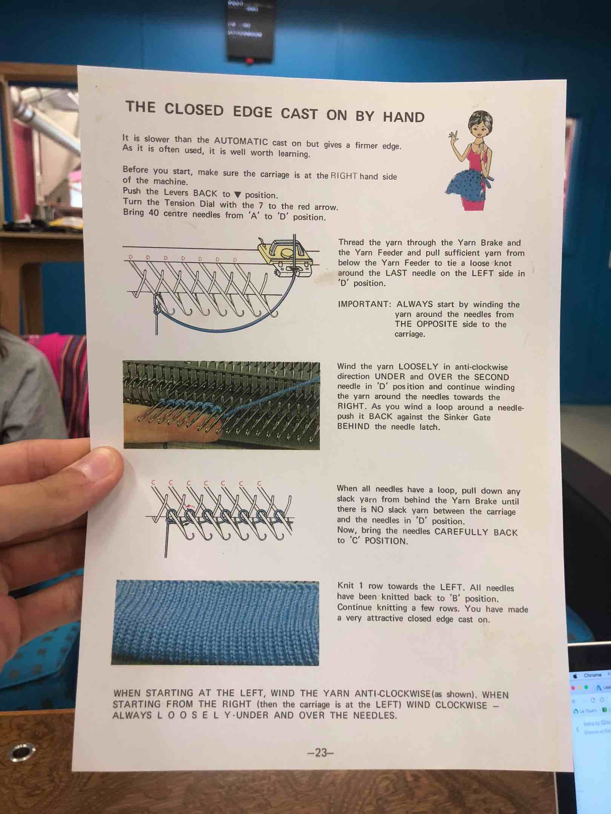

# Intro to Glitch Knitting

**context about the Glitch Knit original project** - [glitchknit.jp](http://glitchknit.jp/)
**more details about the software & settings** - [Fab Lab Wgtn github](https://github.com/FabLabWgtn/KnitHack)

## **welcome - introduction to using the glitch knit machine**

This is an intro to machine knitting, but not as you know it. One of our fabbers hacked a Brother KH-970 knitting machine, using information from Fab Lab Shibuya in Japan. Rather than using punch-cards, this is a digital process, with intentional glitches in the software.

It was very popular in the 80s - 90s! You can make all kind of fun patterns, kinds of stitches that you can control digitally, & use it to make fun textile objects such as beanies!

This machine used to be driven by punchcards and was hacked to be computer-controlled by Fab Lab Kamakura, Fab Lab Wgtn & another Fab Lab in the US

----------

## **steps to get started on the machine**

step 1️- make your design

step 2 - open your design in the software

step 3️- set up the machine

  3.1 - insert the yarn
  3.2 - do the cast on
  3.4. - check & prepare the carriage
  
step 4 - do the cast off

----------

## **basics things to know about this glitch knitting machine**

this machine can do 2 yarn colors at a time - called the yarn A & the yarn B
A being your primary color and B being your secondary color

**what material should we use?**
mid-weight yarn is the best
you don't want it not too light or too heavy

**the machine in itself**

  **the bed**

  there are 200 needles
  the center of the machine bed being the 0 one (100 to the left & 100 to the right)
  the position & number of needles you use are very important
  4 positions possible for the needles
  - A - non working position
  - B - primary knitting row
  - D - secondary knitting row (or holes if you don’t have a secondary thread)
  - E - holes

  **the carriage**

  it slides from the left to the right to help us knit our design!

  Here are all its elements:
  - a tension disk (from 1 to 10)
  - a mode selection (NL, CR ok KC(II))
  - CAM buttons (MC for multi-color for example)
  - CAM button release lever (PLAIN to set CAM buttons back to normal)
  - a holding cam lever (N for normal or H when you want to hold)
  - a sinker plate with a gate (gate goes into ‘A’ or ‘B’ position)

**but first thing first, you should have a design**

if you don't have a design yet, you can create a very simple two-color "check game" design using Paint or just draw a black filled square on white background
save it as a .jpg

if you already have a two-color design saved as a.jpg, you'll just have to drag & drop it into the Glitch Knit machine software!

then, you should wonder what should be the size of your first sample, which means how many needles you're going to use (remember the bed is 200 needles wide)
generally, you will position your garment in the middle of the bed

----------

## **step 1 - open your design in the Glitch Knit machine’s software**

⚠️ at this stage, you should make sure the copper board is plugged into the computer

  here is what to do:
  - go to C: drive > KnitHack > Processing > click on “processing” 
  - should open “Image Converter” in Processing 3 automatically
  - in Processing, hit the “play” button 
   

  **→ the glitch knit software should be up & ready!**

  if something goes wrong, there’s a shortcut to Processing 3 there:
  - go to C: drive > KnitHack > Processing > Image Converter > “processing”
  - in Processing, click on “file” 
  - choose “image converter” in the same folder
  - and it should be alright 

  you can now drag & drop your .jpg picture
  each stitch represent a pixel
  if your 2 colors are black & white, it will turn the image “pixels” into white or black stitches

  in Image Converter, you can: 
  - change the size of your design
  - change the threshold of your pixels/stitches
  - line up your design with the position you want on the bed

----------

## **step 2.1 - insert the yarn**

insert the yarn in the 5 different areas where it needs to be inserted

- put the yarn in **1st metal loop** on the metal antenna above the glitch knit

- there’s a “**white tension wheel**” on the metal antenna, put the yarn between the two metal disks

- put the yarn in **3rd metal loop** on the metal antenna above the glitch knit

- put the yarn in **4th metal loop** on the metal antenna above the glitch knit

- and finally put it into the **sinker plate gate to ‘A’ position** and close it (by flicking the white gate opener)

----------

## **step 2.2 - make the “cast on”**

set everything 
decide what tension you want (how big the loops will be) with the tension disk 
start a little bit loose by setting it to 4 or 5

**→  to make our square, we’re going to use 40 needles today**

here’s how to do a **BY HAND cast on**:

- put the carriage on the right end
- tie off one end of the yarn string to the metal hook under the table
- bring 40 centre needles from the ‘A’ to ‘D’ position 
- open the gates on each needle
- tie a loose knot around the LAST needle on the LEFT side in ‘D’ position
- from left to right, put the yarn thread around each pin

  💡 

- the tension is very important at this stage
  →   too tight - you’ll have a hard time moving the carriage around
  →   too loose - it can tangle and get caught inside, uneven knit

the result should look like this:

----------

## **step 2.3 - check & prepare the carriage**

check the flaps under the carriage
check the white screws above the sinker plate

turn the carriage button to CR (carriage release)
insert the carriage front rail 1st & the back rail 2nd
turn the carriage button back from CR to NL (normal)
slide it a few times to make sure it’s sliding properly

hit the “PLAIN” button to reset the settings
close the “gate”

slide the carriage to the left to make a first line
hold the yarn down
push the needles so the yarn stands on the other side of the latch
slide the carriage to the right  

after the first row
take the knight white guide bar
made to pull your job down, keeps a great tension
hook it onto the first row
pay attention not to have our yarn thread tangled in it

do a couple more rows now
slide to the left
to the right
to the left
to the right
if your job is quite smaller than the weight bar, add the two metal spatula to have a more precise & balanced weight

that’s the basic setup with a single color

----------

## **if you want to move on & use more than one color**

on the carriage, set to “K carriage”

turn the carriage button to KCII (that extend a doofer in the back of the carriage, that will hit switches along the way)
slide from the left end to the right
at this stage, we only had one thread set, so we created little holes (which could be interesting for a design)

now is the right time to set the second color
check the pictures
and hit the MC button on the carriage head (for multi-colors)
slide a few times to see if the new color is behaving as wanted
no need to slide to the extreme end every time (just once so the machine knows the size of the job & position of the carriage)
 
at some stages, you might want to bring the weight bar closer to the bed again to have a better tension

**wanna go back to single-color?**
hit the plain button
take the white yarn off of the carriage head
change the carriage button to NL
do a few slides again, to have new layers of black

----------

## **step 4 - do the “cast off”**

 
💡 first, read these instructions

----------

## **a bit about the maintenance of the Glitch Knit**

from time to time, it’s good to oil the machine
basically all the importants parts (the moving parts below the carriage + the pins)

----------

## **what you should practice after the workshop**

- inserting the yarn & set everything to neutral
- do the cast on
- change the tension - to change the gages
- make holes
- make ladders
- make holds = "turns" (knitting on one side but not the other)
- make stripes - changing colors
- make jacquard (two colors at a time)
- make puckers
- do the cast off

to run a **workshop** about the Glitch Knit machine, a reasonable goal would be to play around with plain stitching & changing colors to make a small-sized beanie

----------

## **make your first object - create a small-sized beanie**

do the cast on
do 2 lines holding it down with your hand
put the weight clamps

follow a 2 needles in - 1 out - 2 needles in - 1 out pattern for the mock rib
do 20 lines
do 1 line with nothing
do 20 lines

then 30 lines
then take out 1 needle on each side
do 2 more lines
take out 1 needle on each side again
do 2 more line

until you have 10 needles

do the cast off

iron the hat
wash it under hot water

sew it together

